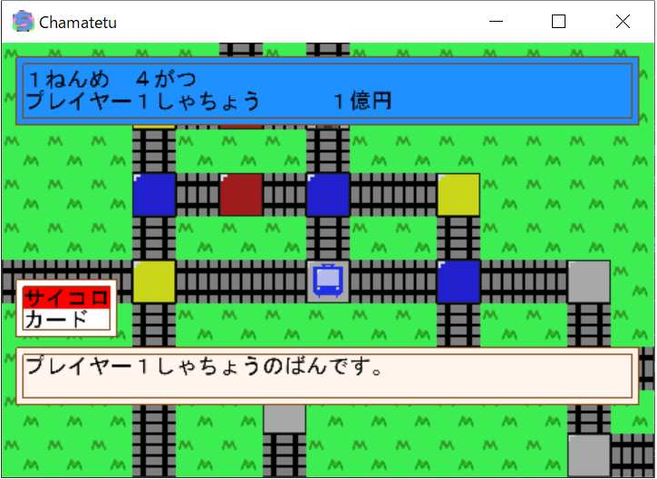
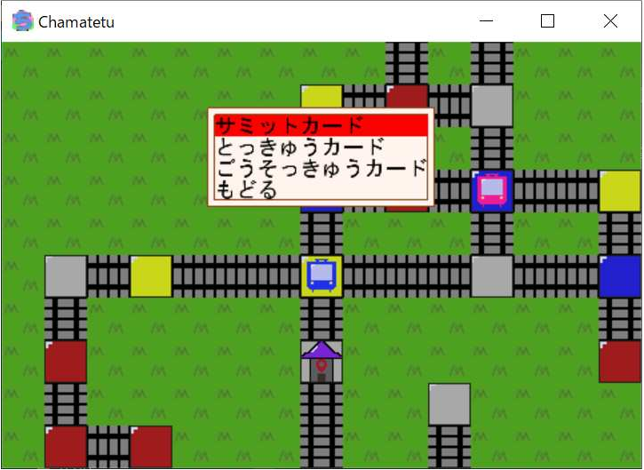

# 4J_Chamatetu






## Description
4Jで作成したミニゲーム「ちゃま鉄」のプロジェクトファイルです.実装した機能としては次に示すものがあります.

- 日本語の描画
- 年,月,季節の管理
- 動的かつ季節に応じたマップ描画
- プレイヤーの移動
- 物件駅,プラス駅,マイナス駅,カード駅
- 物件の購入操作,独占
- 決算と最終成績
- 借金時の物件自動売却
- カード(急行,特急,新幹線,サミット,ぶっとび,10億円,徳政令,豪速球)

## Directory structure
```
.
├── hash.txt : ハッシュ値
├── j17406 : 提出したファイル(解凍済み)
├── j17406.tar.gz : 100年戦争version
├── j17406sumbit : 提出したファイル
├── property : 物件情報
├── repo : レポート
└── 開発用 : 開発用のフォルダ
```